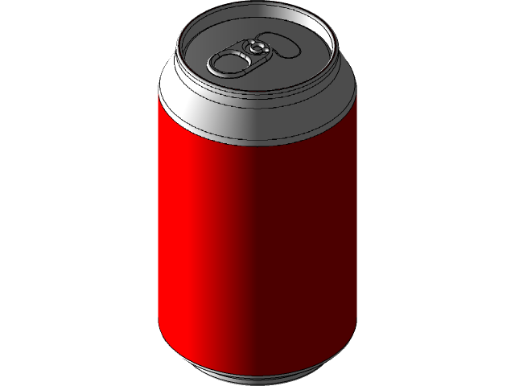
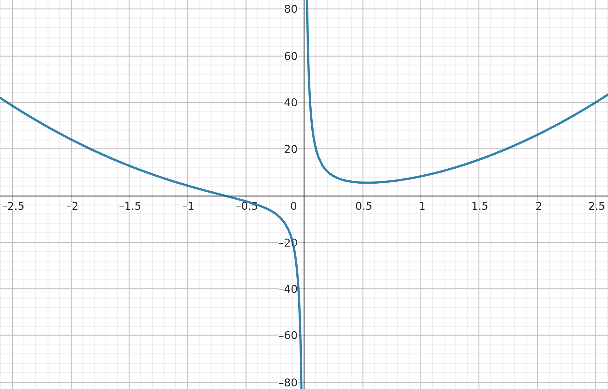
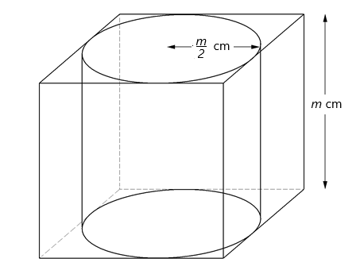

# Notas - Unidad 0

## Estudio de funciones

### Definición de función
Una función $f$ es una regla que asigna a cada elemento $x$ en un conjunto $D$ 
exactamente un elemento, llamado $f(x)$, en un conjunto $E$.

### Funciones crecientes y decrecientes
Una función es **creciente** en un intervalo $I$ si
$$
    f(x_1) < f(x_2) \;\; con \; x_1 < x_2 \; en \; I
$$

Una función es **decreciente** en un intervalo $I$ si
$$
    f(x_1) > f(x_2) \;\; con \; x_1 < x_2 \; en \; I
$$

### ¿Qué nos dice $f'$ sobre $f$?
Sea $f: [a, b] \rightarrow \mathbb{R}$ una función continua en $[a, b]$ y 
derivable en $(a, b)$. Entonces, \
1. Si $\forall x \in (a,b): f'(x) > 0 \implies f$ es estrictamente creciente en $[a, b]$  \
2. Si $\forall x \in (a,b): f'(x) < 0 \implies f$ es estrictamente decreciente en $[a, b]$ \
3. Si $\forall x \in (a,b): f'(x) = 0 \implies f$ es constante en $[a, b]$ 

### Concavidad
Si el gráfico de $f$ esta por encima de todas sus tangentes en un intervalo $I$,
entonces se dice **cóncava hacia arriba** en $I$.
Análogamente, si el gráfico de $f$ está por debajo de de todas sus tangentes 
en $I$ se dice **cóncava hacia abajo** en $I$.

### ¿Qué nos dice $f''$ sobre $f$?
* Si $f''(x) > 0$ $\forall x$ en $I$, entonces $f$ es cóncava hacia arriba en $I$ 
* Si $f''(x) < 0$ $\forall x$ en $I$, entonces $f$ es cóncava hacia abajo en $I$ 

### Punto de inflexión
Un punto $P$ en una curva $y = f(x)$ se llama punto de inflexión, si $f$ es
continua en dicho punto y la curva pasa de un tipo de concavidad a otra en $P$.

### Extremos absolutos
Sea $f: D \rightarrow \mathbb{R}$. Se dice que $f$ alcanza un **máximo absoluto**
en el conjunto $D$ si existe al menos un $x_M \in D$ tal que $\forall x \in D: 
f(x) \le f(x_M)$. Al número $f(x_M)$ se lo denomina **valor máximo absoluto** de 
la función.  
Análogamente se define el minimo absoluto.

### Extremos relativos
Sea $f: D \rightarrow \mathbb{R}$. Se dice que $f$ alcanza un máximo relativo en 
el punto $x_M \in D$ si existe un intervalo abierto $I \subset D$ que contiene 
a $x_M$ tal que $\forall x \in I: f(x) \le f(x_M)$
Análogamente se define el minimo relativo.

### Puntos críticos
Un punto crítico de una función $f$ es un valor $c$ en el 
dominio de $f$ tal que o $f'(c) = 0$ o $f'(c)$ no existe.

## Un problema de optimización y análisis

### El problema
Hallar las dimensiones de una lata de gaseosa cilíndrica con un volúmen fijo $V$ que 
tiene la menor área superficial posible (de esta forma utilizando menos material 
y reduciendo los costos de manufactura).

### Una posible solución 
Definamos $r$ como el radio del cilindro y $h$ como su altura.
El volumen $V$ es constante (fijo).  
El área del cilindro es la suma del área de la tapa de arriba, la tapa de abajo
y el área lateral.
Esto es:  
$$
    A = superior + inferior + lateral
$$  

Sabiendo que el área de un círculo es $\pi r^2$ y 
el área lateral es $2 \pi r h$

$$
    \begin{aligned}
        A & = \pi r^2 + \pi r^2 + 2 \pi r h \\
        & = 2 \pi r^2 + 2 \pi r h
    \end{aligned}
$$

El volúmen $V$ de un cilindro es:
$$
    V = \pi r^2 * h
$$

Entonces:

$$
    h = \frac{V}{\pi r^2}
$$

De este modo, podemos reemplazar esta expresión de $h$ en la ecuación del área.
$$
    \begin{aligned}
    A & = 2 \pi r^2 + 2 \pi r (\frac{V}{\pi r^2}) \\
    & = 2 \pi r^2 + \frac{2V}{r}
    \end{aligned}
$$

Observando esto, podemos ver que el área está en función del radio $r$.
De modo que, podemos decir que el área es una función $A(r)$

$$
    A(r) = 2 \pi r^2+ \frac{2V}{r}
$$

> Hay que tener en cuenta que $r > 0$ (porque representa el radio), 
por ende $A(r)$ tiene como dominio $\mathbb{R_{>0}}$.  
Además, la función no está definida en $r = 0$

Ahora tenemos la función que necesitamos minimizar.  

Comenzaremos por hallar puntos críticos de la función. Derivando encontramos:
$$
    A'(r) = 4 \pi r - \frac{2V}{r^2}
$$

Buscamos el valor $r$ para el cual $A'(r) = 0$

$$
    \begin{aligned}
        A'(r) &= 0 \\ \\
        4 \pi r - \frac{2V}{r^2} &= 0 \\ \\
        4 \pi r &= \frac{2V}{r^2} \\ \\
        r^3 &= \frac{2V}{4 \pi} \\ \\
        r^3 &= \frac{V}{2 \pi} \\ \\
        r &= \sqrt[3]{\frac{V}{2 \pi}}
    \end{aligned}
$$

Un punto crítico $r_c$ para $A(r)$ es
$$
    r_c = \sqrt[3]{\frac{V}{2 \pi}}
$$

Ahora necesitamos confirmar que esto es un minimo (relativo), y además que es el 
minimo absoluto.

Sabemos por los cálculos anteriores que $A'(r_c) = 0$, entonces nos interesa
descubrir como se comporta $A'(r)$ para valores de $r$ tal que $0 < r < r_c$ y 
para valores de $r$ tal que $r_c < r$.  

Evaluando $A'(r)$ en valores dentro de esos intervalos nos da los siguientes 
resultados:

| $r$           | $A'(r)$ | Comportamiento de $A(r)$ |
| :-----------: | :-----: | :----------------------: |
| $0 < r < r_c$ | $< 0$   | Decrece                  |
| $r_c$         | $0$     | -                        |
| $r_c < r$     | $> 0$   | Crece                    |

Como la función pasa de tener un comportamiento decreciente a un 
comportamiento creciente podemos confirmar con seguridad de que $r_c$ se trata
de un minimo relativo.

Finalmente, también es un minimo absoluto en el intervalo (0, $\infty$), ya que 
es el menor valor en dicho intervalo.

> Ya que estamos trabajando sobre un intervalo cerrado, podemos convencernos de lo anterior
evaluando $\lim_{r\to\infty} A(r) = \infty$ y $\lim_{r\to0^+} A(r) = \infty$

Recordemos que debemos encontrar todas las dimensiones que forman el cilíndro,
ya conocemos el valor de $r$ óptimo, ahora resta encontrar el valor de $h$. Para ello,
solo basta reemplazar $r$ por $r_c$ en la expresión encontrada previamente para $h$:
$$
\begin{aligned}
    h &= \frac{V}{\pi r^2} \\ \\
      &= \frac{V}{\pi (\sqrt[3]{\frac{V}{2 \pi}})^2} \\ \\
      &= \frac{V (\sqrt[3]{2 \pi})^2}{\pi (\sqrt[3]{V})^2} \\ \\
      &= \frac{V}{\sqrt[3]{V^2}} \cdot \frac{\sqrt[3]{4 \pi^2}}{\pi} \\ \\
      &= \sqrt[3]{\frac{V^3}{V^2}} \cdot \sqrt[3]{\frac{4 \pi^2}{\pi^3}} \\ \\
      h &= \sqrt[3]{\frac{4V}{\pi}}
\end{aligned}
$$

Con esto ya tenemos todas las dimensiones del cilíndro $h$ y $r$. 

Es interesante notar que: 
$$
\begin{aligned}
    \frac{h}{r} &= \sqrt[3]{\frac{4V \cdot 2\pi}{\pi \cdot  V}} \\ \\
        &= \sqrt[3]{8} = 2
\end{aligned}
$$

Lo que implica que la altura es 2 veces el radio ($h = 2r$). Dicho de otra manera,
la altura debe ser igual que el diámetro.

Esto resulta en una lata cilíndrica con forma "cúbica"

