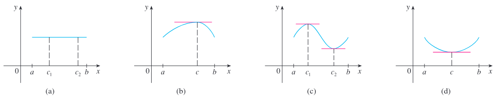

# Notas - Unidad 1

## Aproximaciones de una función

<!--  -->

### Teorema de Rolle
Sea $f$ una función que cumple con las siguientes tres hipótesis:  

1. $f$ es continua en el intervalo cerrado $[a, b]$. \
2. $f$ es derivable en el intervalo abierto $(a, b)$. \
3. $f(a) = f(b)$ \

Entonces existe un número $c$ en $(a, b)$ tal que $f'(c) = 0$

Ejemplos de funciones que satisfacen las hipótesis del Teorema de Rolle:

## Teorema del valor medio (Lagrange)
Sea $f$ una función que cumple con las siguientes hipótesis:  

1. $f$ es continua en el intervalo cerrado $[a, b]$. \
2. $f$ es derivable en el intervalo abierto $(a, b)$. \

Entonces existe un número $c$ en $(a, b)$ tal que: 
$$
    f'(c) = \frac{f(b)-f(a)}{b-a}
$$

### Teorema
Si $f'(x) = 0$ para todo $x$ en un intervalo $(a, b)$, entonces $f$ es constante 
en $(a, b)$

**Demostración: **
Sean $x_1$ y $x_2$ dos valores cualquiera en $(a, b)$ con $x1 < x2$. Como $f$
es derivable en $(a, b)$ también lo es en $(x_1, x_2)$ y continua en en $[x_1, x_2]$.  
Aplicando el Teorema del valor medio a $f$ en el intervalo $[x_1, x_2]$ se obtiene 
un valor $c$ tal que:

$$
    f'(c) = \frac{f(x_2)-f(x_1)}{x_2-x_1}
$$

Pero como $f'(x) = 0$ para todo $x$, entonces $f'(c) = 0$.

$$
\begin{aligned}
    0 &= \frac{f(x_2)-f(x_1)}{x_2-x_1} \\ \\
    0 &= f(x_2) - f(x_1) 
\end{aligned}
$$

$$
    \implies f(x_2) = f(x_1)
$$

Por lo tanto, $f$ tiene el mismo valor para dos valores cualquiera $x_1$ y $x_2$ 
en $(a, b)$. Esto significa que $f$ es constante en $(a, b)$
